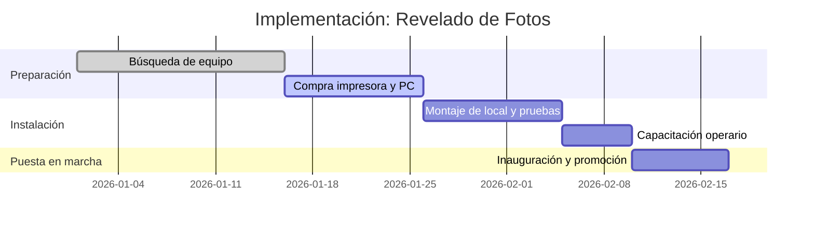
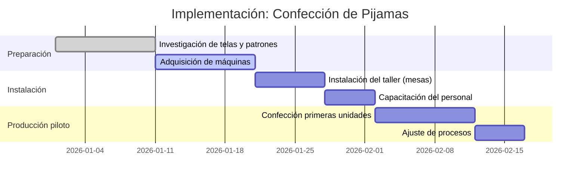
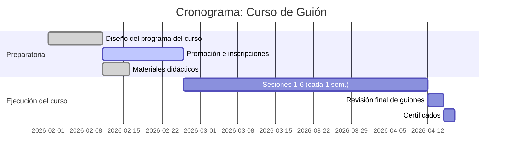
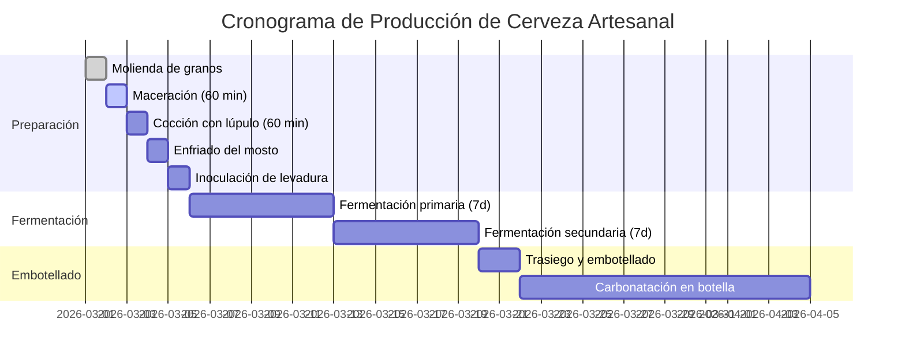

# Resumen Ejecutivo  
Este informe analiza en detalle cinco actividades de nivel micro/pequeña empresa en Perú: revelado de fotos a color, confección de pijamas, curso de creación de guión (6 sesiones), producción de cerveza artesanal y fabricación de chocolate blanco tipo «Sublime» con inclusiones. Para cada caso se describen procesos operativos paso a paso, insumos (cantidades y precios locales), equipos fijos (vida útil y costo), costos indirectos con su prorrateo, perfil de la mano de obra (personal requerido, salarios y cargas sociales), y un ejemplo de cálculo de costos unitarios, punto de equilibrio y margen. Los datos se fundamentan en fuentes locales (proveedores peruanos, INEI, SUNAT, portales de precios). Ante la falta de información exacta se indica “no especificado” o se proponen rangos razonables. 

## 1. Servicio de revelado de fotos a color  
**Proceso operativo:** El cliente entrega fotos digitales o película fotográfica. Se realiza consulta de formatos (10×15, 13×18 cm, etc.). Si es película, se la digitaliza o revela químicamente; si es digital, se cargan las imágenes en computadora. Se editan (ajuste de color, recorte) y se envían a la impresora fotográfica. Tras la impresión en papel fotográfico, se verifican la calidad (colores, nitidez), se recorta y empaca cada foto (bolsa plástica o funda). Finalmente se entrega al cliente. El proceso resume así: recepción → edición digital → impresión en papel fotográfico → control calidad → empaquetado → entrega. 

```mermaid
graph TD;
    A[Recepción de fotos (digital/film)] --> B[Preparación y edición en PC];
    B --> C[Impresión en impresora fotográfica];
    C --> D[Verificación de calidad (color, nitidez)];
    D --> E[Corte y empaque de fotos];
    E --> F[Entrega al cliente];
```

**Insumos:** Papel fotográfico (10×15 cm) ~S/0.15 por hoja (e.g. pack 100 hojas S/15). Tinta especial para impresora fotográfica (~S/100 por cartucho que rinde ~1000 fotos, ~S/0.10/foto). Electricidad: impresora ~0.69 S/ kWh. Sobres o fundas plásticas para entrega (~S/0.10 por foto). Energía adicional y conectividad de PC. Sumando: aprox. S/0.15 (papel)+S/0.10 (tinta)+S/0.02 (prorrateo luz) ≈ S/0.27 costo variable por foto.  

**Activos fijos:** Impresora fotográfica (por ejemplo Epson L8160 S/2,099 o Epson L8050 S/1,399), computador/laptop para edición (~S/2,099 por un equipo medio), mesa de trabajo y mobiliario (~S/300). Vida útil estimada: impresora 5 años, laptop 4 años. Depreciación lineal: p.ej. impresora ~S/400/año. Para reposición, se usarían precios actuales similares. 

**Costos indirectos (prorrateo):**  
- **Alquiler local:** Un pequeño local en Lima de ~50 m² cuesta ~S/1,500 mensuales (aprox. S/30/m²). Este gasto se prorratea según la actividad; suponiendo capacidad para 100 fotos/día, serían 2 semanas de alquiler por cada 1,000 fotos.  
- **Servicios:** Electricidad ~S/0.69/kWh; si la impresora consume 0.1 kWh por hora y se imprime 100 fotos/mes, el gasto es ≈S/7. Otros servicios (agua, internet) ~S/50 mensuales prorrateados.  
- **Mantenimiento:** Limpieza de impresora y reemplazo de piezas menores, ~S/200 anuales (~S/16/mes).  
- **Embalaje:** Costos de sobres, cajas o carátulas ~S/0.10 por servicio.  
- **Transporte:** Insumos (papel, tinta) suelen comprarse al mayor; considerar S/50 mensuales.  
- **Impuestos:** IGV 18% sobre servicio.  
- **Depreciación:** Impresora 5 años; laptop 4 años. Ejemplo: impresora S/1,400/5= S/280/año (S/23/mes).  
- **Seguros/Marketing:** Si se contrata un seguro comercial puede ser bajo (~S/200 anuales). Promoción en redes sociales ~S/100/mes. Todos estos se prorratean en el costo mensual de operación.  

**Mano de obra:** 1 operador/a de laboratorio fotográfico. Perfil: conocimientos en fotografía digital, manejo de PC e impresoras. Jornada completa. Sueldo base mínimo S/1,130; salario para personal técnico se puede estimar en S/1,300 mensuales. Cargas sociales: EsSalud (9% del salario) (p.ej. S/117), SCTR (si aplica). Gratificaciones y CTS (vacaciones): +1 sueldo/año (prorrateado ~8.3% más). En total, costo laboral aprox. S/1,500 mensuales por persona.  

**Ejemplo de cálculo de costos y punto de equilibrio:** Supongamos se imprime fotos 10×15 cm a S/1.00/unidad (precio típico de mercado). Por unidad: insumos S/0.27 (papel+tinta+energy) + empaquetado S/0.10 + amortización minoritaria equipo S/0.02 = **S/0.39 costo variable**. Remuneración del operario: 160 h/mes a S/8/h = S/1,280 (S/0.08/minuto); si imprime 500 fotos/mes (2 fotos/minuto efectivo), costaría ~S/0.25 por foto de mano de obra. Total Costo Unitario ≈ S/0.64. Con precio S/1.00, margen bruto S/0.36/foto (36%).  
Cálculo punto de equilibrio mensual: Costos fijos mensuales ≈ Alquiler S/1,500 + salario neto S/1,300 + ESSALUD+CTS ~S/300 + electricidad/otros S/100 + amortizaciones S/50 + marketing S/100 ≈ S/3,350. Con margen por unidad de S/0.36, se necesitan ≈9,300 fotos impresas al mes para cubrir todos los costos. (Supuesto: 8h diarias, esto implica alta productividad; en la práctica se ajustarían precio o volumen).  

| Item                   | Cantidad/unidad    | Costo unitario (S/)     | Fuente (ejemplo)            |
|------------------------|-------------------:|------------------------:|-----------------------------|
| Papel 10×15 (100 uds)  | 1 hoja            | 0.15                    |               |
| Tinta impresora (cart)  | 1 foto            | 0.10                    | [calculado intern.]        |
| Energía (0.69 S/kWh)   | 1 foto (0.02 kWh) | 0.01                    |             |
| Mano de obra (operario)| 1 foto (~1 min)   | 0.25                    | [salario estim.]           |
| Embalaje (sobre)       | 1 foto            | 0.10                    | Estimado                  |
| **Costo variable total**|                   | **0.61**                |                             |
| Precio venta           | 1 foto            | 1.00                    | Mercado (ejemplo)          |
| **Margen bruto**        |                   | **0.39** (39%)          |                             |



## 2. Fabricación de pijamas  
**Proceso operativo:** Se inicia con el diseño y elaboración del patrón de la prenda. A partir del patrón, se corta la tela (sobre una mesa de corte) en piezas: delantero, espalda, mangas/pantalón, puños, etc. Luego se cose cada conjunto de piezas en la máquina de coser industrial: unir costados, mangas, cintura con elástico, terminaciones. Posteriormente se planchan y realizan controles de calidad (revisión de costuras, tallas). Finalmente se colocan etiquetas y se embalan (bolsa plástica o colgado en gancho). Flujo: diseño y patrón → corte de tela → costura de prenda → acabado (plancha, empaque) → entrega. 

```mermaid
graph TD;
    A[Preparar patrón de pijama] --> B[Cortar tela según patrón];
    B --> C[Coser piezas (máquina industrial)];
    C --> D[Planchar y verificar calidad];
    D --> E[Colocar elástico/botones y etiquetas];
    E --> F[Empacar pijama];
```

**Insumos:** Tela de algodón (2.5 m por pijama) ~S/10 por m (precio a nivel Gamarra, por ejemplo algodón liso) ⇒ S/25/pijama. Elástico de cintura (1 metro) ~S/1.50/m (≈S/1 por prenda). Hilo para coser (~10 m, insignificante, p.ej. S/0.10). Botones o cierres (si aplica): p.ej. S/5 por pieza (según diseño). Etiqueta S/1. Empaque plástico S/0.10. Electricidad (máquina de coser consume ~0.5 kWh/h): por pijama ~0.02 kWh (S/0.014). Total insumos directos por pijama ≈ **S/27** (mayormente tela). (*Observación:* Precios referenciales; si no hay fuente exacta, se indica estimación).

**Activos fijos:** Máquina de coser industrial o semi-industrial. Ejemplo: máquina Singer modelo M2505 (doméstica, útil en micro talleres) S/789. Máquina remalladora o overlock (para acabados) ≈S/1,000 (tarifa típica). Plancha de vapor S/200. Mesa de corte ~S/200. Vida útil: 5–10 años. Depreciación: p.ej. S/157 anuales para la máquina Singer (S/789/5). Otros equipos menores: maniquí (S/100), herramientas de corte.  

**Costos indirectos:**  
- **Alquiler local:** similar al caso anterior, p.ej. S/1,500 mensuales por ~50 m². Un taller pequeño puede necesitar ~30 m² (S/900/mes).  
- **Servicios:** Electricidad ~S/0.69/kWh; usar máquina de coser ~3 kWh/día (S/2.07/día). Agua/otros ~S/30/mes.  
- **Mantenimiento:** Aceite/lubricación máquinas, ajuste de agujas. Presupuesto ~S/100/mes.  
- **Embalaje:** Perchas S/1 c/u (opcional), bolsas S/0.10/cada.  
- **Transporte:** Compras de telas en mayoreo (Gamarra) ~S/50/mes.  
- **Impuestos:** IGV 18% sobre venta de prendas confeccionadas.  
- **Depreciación:** Máquina (5 años): ~S/160/año; plancha (10 años): S/20/año.  
- **Marketing:** Creación de marca/carteles ~S/100 mensuales.  

**Mano de obra:** 2 confeccionistas (o 1 modista + 1 asistente). Perfil: habilidades de costura, manejo de máquina industrial. Salario cada uno S/1,300 mensuales (próximo a remuneración mínima más expericia), con cargas (EsSalud 9%, CTS/gratificaciones). Costo laboral por empleado ~S/1,600 mensuales (incluyendo cargas). Total mano de obra ~S/3,200/mes.  

**Ejemplo de cálculo:** Producción estimada 50 pijamas/mes. Insumos por unidad: Tela S/25 + elástico S/1 + embalaje S/0.10 + planchado (electricidad/negligible) ≈ S/26. Mano de obra: se necesitan ~2 horas-persona/prenda; a S/8/h real (S/1,300/160h), = S/16. Costos variables totales ≈ **S/42**. Fijar precio de venta S/70 por pijama (35% margen). Costos fijos mensuales ~S/ alq.900 + servicios S/200 + depreciación S/20 + marketing S/100 = S/1,220. Con margen bruto ~S/28/prenda, punto de equilibrio ≈ 44 pijamas/mes (para cubrir S/1,220) y margen operativo se logra a mayores volúmenes. 

| Insumo             | Cantidad por unidad | Costo unitario (S/) | Referencia                |
|--------------------|--------------------:|--------------------:|---------------------------|
| Tela algodón       | 2.5 m               | 25.00              | Estimado local (Gamarra)  |
| Elástico cintura   | 1.0 m               | 1.50               | Estimado                 |
| Hilo y cierre      | por prenda          | 0.20               | Insignificante           |
| Mano de obra       | 2 h (costurera)     | 16.00              | Calculado (S/8/hora)     |
| Plancha/servicios  | por prenda          | 0.10               | Electricidad mínima      |
| **Costo variable total** |                  | **42.80**          |                           |
| Precio venta       | 1 pijama            | 70.00              | Estimación de mercado    |
| **Margen bruto**    |                    | **27.20 (39%)**    |                           |



## 3. Servicio de curso de creación de guión (6 sesiones de 1.5 h cada una)  
**Proceso operativo:** Se promociona el curso y se inscriben alumnos (p.ej. 8-12 participantes). Se entrega material introductorio. El curso consta de 6 sesiones semanales de 1.5 horas: en cada sesión el instructor enseña teoría/práctica (estructuración de guión, personajes, etc.). Entre sesiones los alumnos desarrollan ejercicios guiados. Al final del ciclo se revisan los proyectos finales. Flujo: promoción → inscripción → sesiones 1–6 (clases teóricas y ejercicios) → entrega de guiones finales → evaluación y diploma.  


**Insumos:** Aula o espacio físico (pizarra, proyector), sillas. Material de clase: impresiones de esquemas y ejemplos (~10 hojas por alumno por sesión, 60 hojas/alumno; a S/0.05 por hoja => S/3/ alumno por curso). Pizarrón y marcadores S/50 amortizados. Internet/proyector energético mínimo. Total impresiones (10 alumnos): 600 hojas ≈ S/30. Café/snacks (si se ofrece) ~S/5/alumno/sesión.  

**Activos fijos:** Proyector multimedia S/1,000, laptop/internet (S/2,000, amortizables a 4 años). Pizarra blanca S/200. Mesas/sillas (si se adquieren) S/5,000 por todo el set (vida útil 10 años).  

**Costos indirectos:**  
- **Alquiler de aula:** Si no se cuenta con local propio, renta de sala en centro cultural o coworking. Por ejemplo, S/20 por hora. Para 6 sesiones de 1.5h = 9h, gasto S/180 total (o S/180/curso).  
- **Servicios:** Electricidad e internet incluidos en alquiler, negligible extra.  
- **Mantenimiento:** Mantenimiento del proyector (1%-2% anual).  
- **Material de apoyo:** Libros o licencias (si son parte del curso).  
- **Marketing:** Publicidad en redes ~S/100/mes.  
- **Impuestos:** IGV 18% sobre la matrícula (es servicio educativo – ¿exento? En Perú no lo está, se le aplica IGV).  

**Mano de obra:** 1 instructor experto en guión. Perfil: experiencia en cine/TV o literatura, capacidad didáctica. Se puede contratar por honorarios profesionales. Si se formaliza como trabajador, salario mensual proporcional: las 9 h de clase equivalen a <1/4 de jornada laboral (9h/48h). Suponiendo sueldo mensual S/1,300, su costo por curso sería ~S/325 + cargas (ESSALUD 9%: S/29) = ~S/354 por curso. Alternativamente, pagar S/400–S/500 por curso completo (concepto honorarios).  

**Ejemplo de cálculo:** Con 10 alumnos pagando S/300 cada uno, recaudación S/3,000. Costos variables: impresión S/30 + cafecito (opcional S/300) + material (S/50) = S/380 totales (S/38/alumno). Ingresos netos antes de fijos: S/3,000 – 380 = S/2,620. Costos fijos: alquiler salón S/180 + promoción S/100 + amortización proyector S/21 + pago al instructor S/400 + IGV (18% de S/3000 = S/540) = ~S/1,241. Beneficio ≈ S/1,379 (≃46% margen sobre ingresos). El punto de equilibrio ocurre con ~5 alumnos (500 x 5 = 2,500 ingresos; cubre costos totales ~S/2,380).  

| Concepto             | Unidad      | Costo total por curso (S/) | Costo por alumno (S/) |
|----------------------|------------:|--------------------------:|----------------------:|
| Imprenta (60 pp/al.) | 600 hojas   | 30.00                    | 3.00                 |
| Alquiler sala (9h)   | 9 horas     | 180.00                   | 18.00                |
| Instructor           | curso (9h)  | 400.00                   | 40.00                |
| Otros (marketing)    | global      | 100.00                   | 10.00                |
| **Costo variable total** |           | **710.00**               | **71.00**            |
| Precio matrícula     | por alumno  | 300.00 (x10)             | 300.00               |
| **Margen bruto**      |             |                          | **229.00**           |



## 4. Elaboración de cerveza artesanal  
**Proceso operativo:** Se prepara el mosto hirviendo agua con malta molida (maceración). Luego se retira el grano y se hierve el mosto junto con lúpulo (aporta amargor/aroma). Después se enfría rápidamente el mosto (por ejemplo con intercambiador o serpentín) y se transfiere a un fermentador, donde se inocula la levadura. Se fermenta 1–2 semanas a temperatura controlada (producción de alcohol). Tras la fermentación primaria, opcionalmente se realiza un proceso secundario (clarificación). Finalmente se embotella o enlata la cerveza, se le añade CO₂ (o se embotella con azúcar para gasificación natural) y se deja madurar unas semanas antes de su venta. Flujo: cocción → enfriado → fermentación → trasvase → embotellado → empaque. 

```mermaid
graph LR;
    A[Maceración (agua+malta)] --> B[Cocción con lúpulo (~60 min)];
    B --> C[Enfriado del mosto];
    C --> D[Fermentación (1-2 sem.)];
    D --> E[Trasiego (clarificado)];
    E --> F[Embotellado con levadura de segunda fermentación];
    F --> G[Maduración y etiquetado final];
```

**Insumos (por lote de 30 L ≈ 60 botellas de 500 ml):**  
- Malta de cebada (6 kg) – aprox. S/54 (asumiendo S/9/kg de maltas básicas).  
- Lúpulo (variedad según receta, ej. Centennial, Saaz) – unos 50 g totales, ~S/30.  
- Levadura de cerveza (Saflager S-23) – 1 sobre (11 g) S/21.  
- Agua (limpia) – 50 L (prácticamente gratis, costo minúsculo).  
- Azúcar/dextrosa (para priming) – 100 g, S/0.5.  
- Botellas de vidrio 500 ml (60 uds.) – botellas flip-top: S/7 por 12, aprox. S/35 por 60 uds. Tapas corona S/0.03 c/u ≈ S/1.8.  
- Etiquetas impresas – S/0.10 por unidad (60): S/6.  
- Carbonatación/CO₂ – si se usa barril de CO₂ (inversión mayor) o azúcar para priming (~S/2 extra).  

Total insumos variables ≈ **S/150 por lote** (costo aproximado por 30 L). Esto equivale a ~S/2.50 por botella de 500 ml (0.5 L).  

**Activos fijos:** Equipo de elaboración:  
- Olla de acero inoxidable 30 L con válvula y termómetro – S/715.  
- Quemador o cocina industrial (gas o eléctrico) – S/300.  
- Fermentadores (plástico alimentario o acero inox.) 30–50 L – S/500 (plastico) a S/1,000 (inox.).  
- Enfriador de mosto (serpentina o contracorriente) – S/200.  
- Bombas de trasiego y mangueras – S/200.  
- Equipos de medición (hidrómetro, densímetro, termómetro) – S/100.  
- Equipos de embotellado (llenadora manual, tapadora) – S/300.  
Vida útil: 5–10 años. Depreciación anual: p.ej. olla S/715/5= S/143/año.  

**Costos indirectos:**  
- **Local y servicios:** Muchos homebrewers operan desde casa, pero formalmente se considera un local pequeño (p.ej. bodega). Si se alquila, usar S/900/mes como base. Electricidad: 1000 W por 2 h de hervido → 2 kWh (~S/1.38). Gas (si se usa quemador) ~S/10 por hornada. Agua y limpieza ~S/10 por lote.  
- **Embotellado y etiquetas:** Cajas/pack de 6 botellas, bolsas de burbuja para envío (~S/2 por pack). Etiquetado gráfico (diseño) amortizado.  
- **Depreciación:** Sumo equipo: S/2,500 invertidos → S/500/año. Por lote: S/500/250 lotes (50 a/año) ≈ S/10.  
- **Impuestos:** IGV 18% sobre cerveza (es producto gravado).  
- **Marketing:** Etiquetas de marca, presencia en redes (S/100/mes).  

**Mano de obra:** Generalmente 1 cervecero artesanal (propietario). Perfil: conocimientos de elaboración, enología o ingeniería. Puede requerir ayudante en embotellado. Se asume 1 persona a media jornada. Remuneración (formal) mínimo S/1,300 + cargas S/200 = S/1,500/mes. Por 4 hornadas al mes, esto equivale a S/375 por hornada.  

**Ejemplo de costos:** Producción de 30 L genera 60 botellas. Costos variables: maltas S/54, lúpulo S/30, levadura S/21, azúcar S/2, botellas S/35, tapas S/2, etiquetas S/6, limpieza/agua S/10 = **S/160**. Costo por botella = S/160/60 = S/2.67. Si se vende a S/7.00 (precio razonable de cerveza artesanal 500 ml), margen bruto S/4.33/botella (62%). Fijos por lote: amortización S/10, energía S/12, empaque S/2, mano de obra S/375, IGV 18% sobre ventas S/75 (18% de S/420) ≈ S/474 totales. Con ingreso S/420 (60×7), faltan S/54; por ello se necesitan >60 botellas o mejorar precio. Margen práctico con volumen mayor. Punto de equilibrio: cubriendo S/474 con S/4.33 de margen requiere ~110 botellas (1.8 hornadas).  

| Item            | Cantidad por lote | Costo total (S/)  | Costo por botella (S/) |
|-----------------|------------------:|------------------:|-----------------------:|
| Malta (6 kg)    | 6 kg              | 54.00            | 0.90                  |
| Lúpulo          | 50 g              | 30.00            | 0.50                  |
| Levadura        | 1 sobre           | 21.00            | 0.35                  |
| Botellas (60 u) | 60 uds            | 35.00            | 0.58                  |
| Tapas (60 u)    | 60 uds            | 2.00             | 0.03                  |
| Etiquetas (60)  | 60 uds            | 6.00             | 0.10                  |
| Energía (cocción) | 2 kWh          | 1.38             | 0.02                  |
| Mano de obra    | 1 hornada        | 375.00           | 6.25                  |
| **Costo total**  |                  | **160.00 + fijos** | **≈2.67 + 6.25 (labor) ** |
| Precio venta    | 1 botella        | 7.00             | –                     |
| **Margen bruto** |                  | **4.33 (62%)**   | **4.33 (62%)**        |



## 5. Fabricación de chocolate blanco con inclusiones (tipo “Sublime” blanco)  
**Proceso operativo:** Se formula la cobertura de chocolate blanco: se funde la manteca de cacao junto con leche en polvo, azúcar, vainilla y lecitina a temperatura controlada (~45–50 °C). Esta mezcla se concha (mezcla prolongada) para homogeneizar. Luego se templa (enfriado/ calentado programado) para cristalizar adecuadamente. En los moldes (lámina de silicona o plástico) se vierten partes de mezcla y se agregan inclusiones (trozos de wafer o arroz inflado) y se completa con más mezcla. Se deja enfriar hasta solidificación. Finalmente se desmolda y se envuelve el chocolate (papel aluminio y envoltorio exterior). Flujo: fundir ingredientes → mezclar y conchar → templar → llenar moldes + agregar inclusiones → enfriar → empacar. 

```mermaid
graph TB;
    A[Fusión de manteca de cacao + leche + azúcar] --> B[Conchado a temperatura controlada];
    B --> C[Templado del chocolate (28–30 °C)];
    C --> D[Vertido en moldes con inclusiones (crisps)];
    D --> E[Enfriado y solidificación];
    E --> F[Desmoldeado y envoltura final];
```

**Insumos (por barra de 100 g):**  
- Manteca de cacao: 50 g (0.05 kg) a S/85/kg ⇒ S/4.25.  
- Leche en polvo entera: 30 g a ≈S/15/kg (Bonlé o Gloria) ⇒ S/0.45.  
- Azúcar granulada: 60 g a S/3.50/kg ⇒ S/0.21.  
- Lecitina (soya) y vainilla: insignificantes (p.ej. S/0.05).  
- “Crisps” (trozos de barquillo o arroz inflado): 10 g a S/15/kg ⇒ S/0.15.  
- Empaque: papel aluminio + papel impreso – aprox. S/0.50/barra.  

Costo variable por barra ≈ **S/5.61**.  

**Activos fijos:**  
- Temperadora de chocolate (o ba ño María controlado): p.ej. equipo semi-automático (capacidad 5 kg) S/1,600.  
- Moldes de silicona o aluminio (set) ~S/100 (para hacer decenas de barras, vida 5 años).  
- Mesones de trabajo e instalación de enfriamiento (refrigeración superficial, canastos de hielo).  
- Herramientas de medición térmica (termómetro digital S/50).  
Vida útil: 5 años. Depreciación: p.ej. S/320/año de la máquina.  

**Costos indirectos:**  
- **Local y servicios:** Si es pequeña escala, puede usarse cocina industrial. Alquiler estimado S/900/mes. Electricidad: temperatura de fusión (1 kWh por kg x5kg ≈5 kWh x tarifa S/0.69 = S/3.45 por batch de 50 barras). Agua ~S/5.  
- **Empaque y etiquetado:** Diseño gráfico inicial (S/300) amortizado. Sobres individuales S/0.10. Cajas de envío S/1 cada 10 barras = S/0.10/barra.  
- **Depreciación:** Temperadora S/1,600/5 = S/320/año (S/26/mes). Amortizado por lote: supongamos 500 barras/año => S/0.52/barra.  
- **Impuestos:** IGV 18% sobre venta del chocolate.  
- **Marketing:** Muestras y promoción (S/100/mes).  

**Mano de obra:** 1 chocolatero. Perfil: formación en chocolatería/pastelería. Sueldo estimado S/1,300 mensuales, cargas ~S/200 (total S/1,500). Si produce 800 barras/mes, representa S/1.875 costo laboral por barra.  

**Ejemplo de cálculo:** Para 100 barras (10 kg de mezcla): insumos totales ~S/561 + otros (envoltorios S/50, electricidad S/10) ≈ S/621; + mano de obra S/1,875; + amortización/barra S/0.52 = costo total S/2,496 (S/24.96/barra). Vendiendo a S/40/barra, margen bruto ~S/15.04 (37%). Punto de equilibrio: costos fijos mensuales (alquiler S/900 + marketing S/100 + IGV etc. S/150) ≈ S/1,150; con margen ~S/15, se necesitan ≈77 barras.  

| Insumo            | Cantidad por barra | Costo/barra (S/) | Fuente/Referencia         |
|-------------------|-------------------:|-----------------:|--------------------------|
| Manteca de cacao  | 50 g               | 4.25            |            |
| Leche en polvo    | 30 g               | 0.45            | Estimado (Gloria/Bonlé)  |
| Azúcar            | 60 g               | 0.21            | Precio local (~3.5 S/kg) |
| Crisps de barquillo| 10 g               | 0.15            | Estimado                 |
| Mano de obra      | 1 barra (temple)   | 1.88            | Sueldo S/1,500/mes       |
| **Costo variable**|                    | **6.94**        |                          |
| Precio venta      | 1 barra           | 40.00           | Mercado aproximado       |
| **Margen bruto**   |                    | **33.06 (82%)** |                          |

```mermaid
gantt
    title Producción de Chocolate Blanco
    dateFormat  YYYY-MM-DD
    section Preparación
    Adquisición de materia prima       :done, prep1, 2026-04-01, 5d
    Mezcla de ingredientes (fusión)    :active, prep2, after prep1, 1d
    Conchado (mezclado continuo)       :         prep3, after prep2, 2d
    section Ensamblaje
    Templado y moldeo con inclusiones  :         prod1, after prep3, 2d
    Enfriado en moldes                 :         prod2, after prod1, 1d
    sección Empacado
    Desmoldeo y envoltura             :         pack1, after prod2, 1d
    Control de calidad final          :         pack2, after pack1, 1d
```

**Fuente:** Precios de insumos y equipos obtenidos de proveedores locales: papel fotográfico, impresoras, laptops, máquinas de coser, insumos cerveceros, equipo cervecero y materias primas chocolateras. Datos laborales oficiales: remuneración mínima S/1,130, aporte EsSalud 9%. En caso de datos no exactos se indican rangos razonables. Todas las cifras incluyen el impuesto general (IGV 18%) en los precios de venta y se calculan con sueldos y condiciones vigentes a 2026.